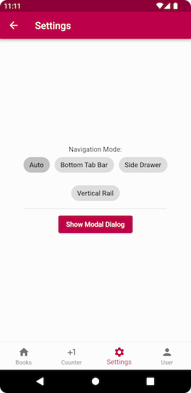
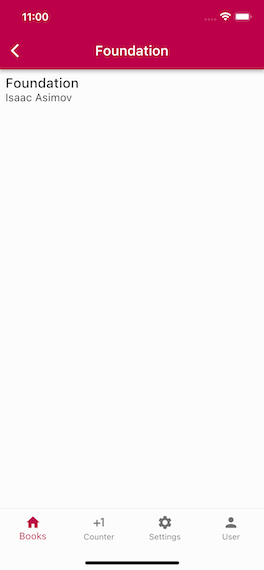

# Flutter Application Starter

This repo is a Flutter application starter. You can clone it, run it and start customizing it to make it yours.

It holds a small [library](./lib) and a [sample application](./example/)

## Summary

This application starter abstracts away sources of boilerplate like
declarative navigation, ephemeral state and application state
management, parsing user-typed urls and bookmarks when running
in the browser, screen orientation handling, modal screens - leaving
you to implement [Screens](./example/lib/src/screens/),
[Routes](./example/lib/src/routing), [persistent state](./example/lib/src/dal/),
and tie everything together in a small, clean [main.dart](./example/lib/main.dart).

This application starter reins in the issues
stemming from the difficulty of making
[declarative navigation](https://medium.com/flutter/learning-flutters-new-navigation-and-routing-system-7c9068155ade),
[application state, and ephemeral state](https://docs.flutter.dev/development/data-and-backend/state-mgmt/ephemeral-vs-app)
work together. Most intro-level samples will show you how to use
them in isolation, but in reality it's quite challenging to get
these concerns implemented in a way that does not bog the developer
down in an ocean of hacks and interdependencies.

Clone and evolve your own application if you don't want to fight
the boilerplate war. For the state management it uses
[Riverpod](https://riverpod.dev/) - the successor of the popular
[Provider](https://github.com/rrousselGit/provider) package, both
created by the same person. The [Riverpod Restorable](https://pub.dev/packages/flutter_riverpod_restorable)
extends the Riverpod state management model to dealing with the
ephemeral state, which is crucial to the UX for users of low-RAM,
older Android phones.

The project goes past the typical PoC/HelloWorld and showcases more
real-world-ish approach, where the app has its state restored after
it gets evicted on Android when user switches between apps and back,
where the async application initialization code has a clear place
with the corresponding waiting UI, and where the application state
gets rebuilt when the web browser user jumps to a bookmark.

### A Deeper Dive

Features delivered by this library out-of-the-box are:
- Near zero boilerplate code in the application (see the main.dart example below).
- Tab-based and non-tabbed navigation using Flutter Router instead of the Navigator.
- Flutter v2 declarative navigation approach - crucial for supporting
  Web - enabling parsing and routing for user-typed (Web) URL.
- Properly wired [Riverpod](https://pub.dev/packages/flutter_riverpod) app state management.
- Ephemeral state restoration with [Riverpod Restorable](https://pub.dev/packages/flutter_riverpod_restorable).
- Responsive handling of navigation controls when device
  screen orientation changes.
- Support of the 404 page when user types an unknown URL in the browser URL bar.
- Easy creation of modal screens.
- A [separate branch](https://github.com/vgribok/flutter_nav2_oop/tree/ios-and-android-only)
  shows the (iOS and Android only) implementation of the
  camera usage with the picture review. Here the real-world approach
  is implemented by ensuring the pictures get the GPS geotagging metadata
  and that the application works correctly on low-RAM, older Android
  phones.

As you can see, this is significantly more than the "Counter" or a
"Hello, World!" examples could ever teach you.

Your application `main.dart` will look like this:
<details>
    <summary>Click to show imports...</summary>

```dart
import 'package:example/src/dal/books_data_access.dart';
import 'package:example/src/dal/stories_data_access.dart';
import 'package:example/src/routing/counter_path.dart';
import 'package:example/src/routing/story/stories_path.dart';
import 'package:example/src/routing/story/story_path.dart';
import 'package:example/src/screens/counter_screen.dart';
import 'package:example/src/screens/story/stories_list_screen.dart';
import 'package:flutter/material.dart';
import 'package:example/src/routing/book_details_path.dart';
import 'package:example/src/routing/book_list_path.dart';
import 'package:example/src/routing/settings_modal_child_path.dart';
import 'package:example/src/routing/settings_path.dart';
import 'package:example/src/routing/user_profile_path.dart';
import 'package:example/src/screens/book_list_screen.dart';
import 'package:example/src/screens/settings_screen.dart';
import 'package:example/src/screens/user_profile_screen.dart';
import 'package:example/theme.dart';
import 'package:flutter_nav2_oop/all.dart';
import 'package:flutter_riverpod/flutter_riverpod.dart';
```
</details>

```dart
/// Run this file to see tab-based navigation demo
void main() {
  runApp(theApp.riverpodApp);
}

/// Simulating some long-ish async app initialization
/// logic, possibly with exceptions thrown
Future<void> _appInitSimulator(Ref ref) async {
  // Simulating an error in the initialization routine
  await Future.delayed(const Duration(milliseconds: 3000));
  //throw UnimplementedError("Something bad has happened..");
}

TabNavAwareApp get theApp => TabNavAwareApp(
    applicationId: "nav-aware-books-sample",
    appTitle: 'Books With Navigation',
    theme: myTheme,
    initialPath: CounterPath(),
    appGlobalStateInitProvider: FutureProvider(_appInitSimulator),
    key: const ValueKey("books-sample-app"),

    globalRestorableProviders: [
      ...booksProvider.ephemerals,
      ...CounterScreen.ephemerals,
      ...Stories.ephemerals,
      ...StoryEx.ephemerals
    ],

    tabs: [
      // Comment out this section to enable non-tab navigation demo
      TabScreenSlot(Icons.home, title: 'Books',
          rootScreenFactory: (tabIndex, ref) => BooksListScreen(tabIndex),
          routeParsers: [ BookListPath.fromUri, BookDetailsPath.fromUri ]
      ),
      TabScreenSlot(Icons.plus_one, title: 'Counter',
          rootScreenFactory: (tabIndex, ref) => CounterScreen(tabIndex),
          routeParsers: [ CounterPath.fromUri ]
      ),
      TabScreenSlot(Icons.settings, title: 'Settings',
          rootScreenFactory: (tabIndex, ref) => SettingsScreen(tabIndex),
          routeParsers: [ SettingsPath.fromUri, SettingsModalChildPath.fromUri ]
      ),
      TabScreenSlot(Icons.person, title: 'User',
          rootScreenFactory: (tabIndex, ref) => UserProfileScreen(tabIndex),
          routeParsers: [ UserProfilePath.fromUri ]
      ),
      TabScreenSlot(
          Icons.interests, title: "Stories",
          rootScreenFactory: (tabIndex, ref) => StoriesListScreen(tabIndex),
          routeParsers: [ StoriesPath.fromUri, StoryPath.fromUri ]
      )
    ]
);
```

Once your [screen](example/lib/src/screens/book_list_screen.dart) and [route](example/lib/src/routing/book_details_path.dart) classes are implemented,
you get your app looking like this on Android, iPhone or Web.




Windows app has been run successfully too.

## Challenge to Overcome

Navigator 2, as a part of Flutter 2.0, is quite [complex](https://miro.medium.com/max/2400/1*hNt4Bc8FZBp_Gqh7iED3FA.png), is [scarcely-documented](https://flutter.dev/docs/development/ui/navigation) by an in-depth but somewhat outdated [Medium post](https://medium.com/flutter/learning-flutters-new-navigation-and-routing-system-7c9068155ade), and requires significant mind-shift to adopt its  declarative style of rendering UI.

> This project has started as an attempt to abstract away FN2 boilerplate code into a reusable set of library classes, and to create a simple application starter template with tabbed navigation enabled by default, and with a few more very basic features, like app state management and restoration.

Declarative UI is an approach where *UI widgets are not responsible managing the state*, but instead are re-rendered on each relevant state change. This approach has become quite common, first popularized to React, and now with Flutter tpp. Still, it poses challenges to navigation flow development as with declarative UI there can *no longer* be a `screenStack.push(topScreen)` type of code. Instead, `Widget[] renderScreenNavStack(appState)` is how navigation stacks are rendered in declarative UIs.

To complicate matters a bit more, supporting web UIs in addition to phone and desktop ones means that routing and navigation has to render meaningful URLs in the web browser address bar, as wells as being able to do the opposite: *construct the navigation stack* state from a URL typed in by a human being.

The [Google-sanctioned app code example](https://gist.github.com/johnpryan/430c1d3ad771c43bf249c07fa3aeef14#file-main-dart) everyone has to rely upon (as of time of writing) to learn Navigator 2 (N2) programming, is pretty opaque, has a good amount of boilerplate, but most importantly, it does not separate concerns, mixing together library/framework parts with actual end-user application logic, resulting in steep learning curve required to make sense of the FN2 and for using it efficiently.

The tasks one would have to solve, with no framework to help, are:
- Compute the screen stack based on the current app state.
- Compute which route to display in web browser's address bar based on the current app state.
- Determine which part of the app state to alter when a screen is removed from the nav stack by user hitting the back navigation arrow.
- Compute the state from the URL entered in the web browser address bar, including support of the 404 route and screen.
- With bottom navigation tab app UI layout, we need to separate tab navigation state management
  from the screens' child/overlay screens.

## Solution Outline

The [reusable library part](./lib/) takes care of the following application UI & navigation development facets.

1. No need to use `BottomNavigationBar` to define your nav tabs and then manually implement tab navigation. Instead you simply [supply tab data](example/lib/main.dart) and tab "root" screen factories.
2. No need to use `Scaffold` to define your screens. Instead you subclass [NavScreen](lib/src/screens/tabbed/tabbed_nav_screen.dart) and override its "`Widget buildBody(BuildContext)`" method.
3. No code duplication for [calculating top screen](https://gist.github.com/johnpryan/430c1d3ad771c43bf249c07fa3aeef14#file-main-dart-L108) and [determining the URL](https://gist.github.com/johnpryan/430c1d3ad771c43bf249c07fa3aeef14#file-main-dart-L88) to show in the browser address bar. Instead, each NavScreen subclasses [override `routePath`](example/lib/src/screens/settings_screen.dart) property getter, letting the framework pick the route URL to display from the top screen of the stack.
4. No need to write [spaghetti code](https://gist.github.com/johnpryan/430c1d3ad771c43bf249c07fa3aeef14#file-main-dart-L36) parsing user-entered browser URLs to set the app state. Instead, each route class has a standard `fromUri(Uri)` [factory method](example/lib/src/routing/user_profile_path.dart) that looks at the user-entered URI and decides whether it matches.
5. Use [`topScreen()` method](example/lib/src/screens/book_list_screen.dart) override to check relevant state and tell the framework whether another "overlay" screen needs to be shown on top of the current one. **This is the famous `UI = f(state)` part in action**.
6. Use [`removeFromNavStackTop()` method](example/lib/src/screens/book_details_screen.dart) override to update the state so that current screen would be removed from the top of the nav stack.
7. Get consistent and straightforward access to mutable state by
   using Riverpod library.
8. Use factories to customize framework-defined UI, like AppBar
   colors, bottom nav tabs, and the 404 screen.

> All of the above enables transparent routing and navigation
> implemented by the framework, leaving you with having to
> **implement only the screens, the routes corresponding to the
> screens, and the wiring-it-together initialization logic**.**
