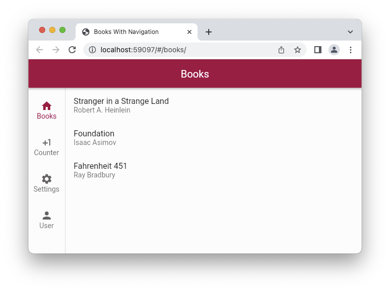

# Flutter 2 Navigator abstracted with OOP

> **TL;DR** If you tried Flutter Navigator 2.0 (FN2) and  were stymied by its complexity and opacity, fear not: this little (necessarily opinionated) library + tabbed app sample combo will ensure that you will not have to spend cycles writing navigation/routing-related boilerplate code and instead focus on your application "meat" code, supplying *[screens](./lib/src/screens)*, *[routes](./lib/src/routing)* that are mapped to those screens, and the *[app initialization code](./lib/main.dart)* wiring together navigation tabs and their "root" screens, to have web & native UI and navigation working out-of-the box: 

 

## Challenge to Overcome

Navigator 2, as a part of Flutter 2.0, is quite [complex](https://miro.medium.com/max/2400/1*hNt4Bc8FZBp_Gqh7iED3FA.png), is [scarcely-documented](https://flutter.dev/docs/development/ui/navigation) by an in-depth but somewhat outdated [Medium post](https://medium.com/flutter/learning-flutters-new-navigation-and-routing-system-7c9068155ade), and requires a significant mind-shift to adopt its embrace of the declarative style of rendering UI.

> This project is an attempt to abstract away FN2 boilerplate code into a reusable set of library classes, and to create a simple application starter template with tabbed navigation enabled by default. 

While declarative UI, where *UI widgets are not part of the state*, but rather are re-rendered on each relevant state change, has become quite common thanks to React, it poses challenges to navigation flow development as with declarative UI there can *no longer* be a `screenStack.push(topScreen)` type of code. Instead, `Widget[] renderScreenNavStack(appState)` is how navigation stacks are rendered in declarative UIs.

To complicate the matter, supporting web UIs in addition to native ones means that routing and navigation has to render meaningful URLs in the web browser address bar, as wells as being able to do the opposite: construct the navigation stack from a URL typed in by a human being.

The [Google-sanctioned app code example](https://gist.github.com/johnpryan/430c1d3ad771c43bf249c07fa3aeef14#file-main-dart) everyone has to rely upon (as of time of writing) to learn Navigator 2 (N2) programming, is pretty opaque, has a good amount of boilerplate, but most importantly, it does not separate concerns, mixing together library/framework parts with actual end-user application logic, resulting in steep learning curve required to make sense of the FN2.

The tasks one would have to solve with no additional framework in in are:
- Compute the screen stack based on the current app state.
- Compute which route to display in web browser's address bar based on the current app state.
- Determine which app state part to alter when a screen is removed from the nav stack by user hitting the back navigation arrow.
- Compute the state from the URL entered in the web browser address bar, including support of the 404 route and screen.
- Assuming bottom navigation tab app UI design, separate tab navigation state management from the screens' child/overlay screens.

## Solution Outline

The [reusable library part](./lib/nav2) takes care of the following application UI & navigation development facets.

1. No need to use `BottomNavigationBar` to define your nav tabs and then manually implement tab navigation. Instead you simply [supply tab data](./lib/main.dart) and tab "root" screen factories.
2. No need to use `Scaffold` to define your screens. Instead you subclass [TabbedNavScreen](./lib/nav2/screens/tabbed_nav_screen.dart) and override its "`Widget buildBody(BuildContext)`" method.
3. No code duplication for [calculating top screen](https://gist.github.com/johnpryan/430c1d3ad771c43bf249c07fa3aeef14#file-main-dart-L108) and [determining the URL](https://gist.github.com/johnpryan/430c1d3ad771c43bf249c07fa3aeef14#file-main-dart-L88) to show in the browser address bar. Instead, each TabbedNavScreen subclass [overrides `routePath`](./lib/src/screens/settings_screen.dart) letting the framework pick the route to show from the top screen of the stack.
4. No need to write [spaghetti code](https://gist.github.com/johnpryan/430c1d3ad771c43bf249c07fa3aeef14#file-main-dart-L36) parsing user-entered browser URLs to set the app state. Instead, each route class has a standard `fromUri(Uri)` [factory method](user_profile_path.dart) that looks at the user-entered URI and decides whether it matches.
5. 